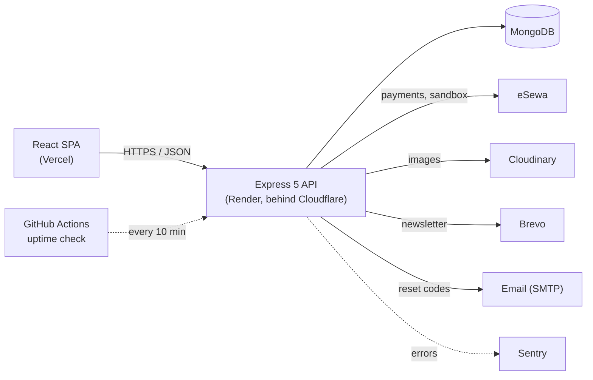

# 🍰 SweetNest Backend

[](https://github.com/AaryanBasnet/SweetNestBackend/actions/workflows/ci.yml)
[](https://github.com/AaryanBasnet/SweetNestBackend/actions/workflows/uptime.yml)

The REST API behind **[SweetNest](https://sweetnest.aaryanbasnet.com.np)**, a custom-cake bakery: catalogue, 3D-designed custom cakes, cart and checkout, eSewa payments, order tracking, loyalty points, reviews, newsletter and an admin dashboard.

**Live API:** `https://api-sweetnest.aaryanbasnet.com.np` (health: [`/health`](https://api-sweetnest.aaryanbasnet.com.np/health), [`/ready`](https://api-sweetnest.aaryanbasnet.com.np/ready)) · Frontend: [SweetNestFrontend](https://github.com/AaryanBasnet/SweetNestFrontend)

> **Try it:** the live site's login page has one-click demo accounts. The demo admin can open every admin screen, but `middleware/demoGuard.js` refuses every change server-side.

### Architecture



Routes → validation (Zod) → controllers → **services** (business rules, no HTTP) → Mongoose models. More on the layering in the Architecture section below.

### Engineering highlights

Each of these was found by testing, fixed, and verified with before and after numbers. The full write-ups are in [`PERFORMANCE_LOG.MD`](PERFORMANCE_LOG.MD).

- **Checkout race condition.** 10 simultaneous checkouts with a single-use 20%-off coupon created **8 orders and gave away Rs 880** of discount. An atomic checkout lock on the cart (one `findOneAndUpdate`, claimed before any pricing runs) now lets exactly **1 order** through, and the other 9 get clean 400 responses.
- **Cart race condition.** Concurrent "add to cart" requests produced duplicate lines and lost quantity updates. An atomic update brings 5 concurrent adds to **one line with quantity 5**.
- **Payments settle exactly once.** eSewa callbacks mark an order paid through a single conditional update (`Order.markPaidOnce`), so a replayed or duplicated callback can't run side effects twice.
- **Catalogue throughput.** Load-testing against 50,000 orders, 5,000 cakes and 20,000 reviews showed that read-only queries were building full Mongoose documents. Adding `.lean()` made them **44–52% faster (median)** with **78–102% more requests per second**.
- **Security:**
  - Password-reset codes are stored hashed, limited in attempts, and requested through an endpoint that can't be used to discover accounts.
  - Changing a password revokes older JWTs.
  - Every public write endpoint is rate limited.
  - Errors never expose stack traces to clients in production.

**Testing:** 251 tests run against a real MongoDB (in-memory locally, a service container in CI) on every push.

This repository contains **only the backend codebase**. The frontend lives in a separate repository and consumes these APIs.

---

## ✨ Overview

The backend is responsible for:

* User authentication & authorization
* Cake, category, and order management
* Loyalty rewards & promotions
* Payment processing with eSewa
* Notifications and email delivery
* Admin analytics and dashboards

It is designed with scalability, validation, and clean separation of concerns in mind.

---

## 🛠 Tech Stack

* **Node.js**
* **Express 5** – REST API framework
* **MongoDB** – database
* **Mongoose** – ODM
* **JWT** – authentication & role-based access
* **Zod** – request validation
* **Cloudinary** – image storage
* **Nodemailer** – email notifications
* **eSewa** – payment gateway integration

---

## 🚀 Features

### Core Features

* User registration, login, password reset
* Role-based access control (Admin / Customer)
* Cake & category CRUD operations
* Cart & order processing
* Order status lifecycle management
* Sweet Points loyalty rewards system
* Promo codes & discounts
* Reviews & ratings
* Address management
* Secure payment verification (eSewa)

### Admin Features

* Product & category management
* Order monitoring & status updates
* Customer management
* Promotion & coupon management
* Notification broadcasting
* Analytics & KPIs endpoints

---

## 📁 Project Structure

```bash
SweetNestBackend/
├── config/         # DB, Cloudinary, email configuration
├── model/          # Mongoose schemas
├── routes/         # API route definitions
├── controller/     # Business logic
├── middleware/     # Auth, error handling, guards
├── services/       # Business rules (pricing, discounts, cart, orders)
├── validators/     # Zod validation schemas
├── utils/          # Helper utilities
├── tests/          # Jest + Supertest suite
│   ├── setup/      # DB lifecycle, test env, isolation
│   ├── helpers/    # Test data factories
│   └── mocks/      # Stubs (email)
├── app.js          # Express app (exported, no listen - testable)
├── server.js       # Process entry: config, DB, listen, shutdown
└── package.json
```

---

## ⚙️ Setup & Installation

### Prerequisites

* Node.js **v16+**
* MongoDB (Local or Atlas)
* Cloudinary account
* Gmail account (App Password enabled)
* eSewa merchant account

---

### Installation

```bash
npm install
```

---

## 🔐 Environment Variables

Create a `.env` file in the root of the backend project:

```env
PORT=5000
DB_URL=mongodb://localhost:27017/SweetNestDatabase
JWT_SECRET=your_jwt_secret_here
EMAIL_USER=your_email@gmail.com
EMAIL_APP_PASSWORD=your_app_password
CLOUDINARY_CLOUD_NAME=your_cloud_name
CLOUDINARY_API_KEY=your_api_key
CLOUDINARY_API_SECRET=your_api_secret
ESEWA_MERCHANT_ID=your_merchant_id
ESEWA_SECRET_KEY=your_secret_key
FRONTEND_URL=http://localhost:5173

# Newsletter (Brevo). Optional double opt-in needs both DOI values.
BREVO_API_KEY=your_brevo_api_key
BREVO_LIST_ID=your_list_id
BREVO_DOI_TEMPLATE_ID=
BREVO_DOI_REDIRECT_URL=
```

See `.env.example` for every variable with an explanation.

---

## ▶️ Running the Server

### Development

```bash
npm run dev
```

### Production

```bash
npm start
```

The API will be available at:

```
http://localhost:5000
```

---

## 🧁 Sample Data & Demo Accounts

| Command | What it does |
|---------|--------------|
| `npm run seed:catalog` | Adds the cake catalogue (idempotent, safe anywhere) |
| `npm run seed:showcase` | Adds ~25 sample customers, two months of orders and verified-purchase reviews, so the dashboard, charts, ratings and order history have real-looking content |

The showcase data lives on `sample.example.com`, a reserved domain, so it can never email a real person. Re-running replaces its own previous data and never touches real customers; `--wipe-only` removes it. Order dates are relative to the day it runs, so re-run it to keep the dashboard's "last 7 days" current. Running against `NODE_ENV=production` needs `--allow-production`.

With `DEMO_ACCOUNTS_ENABLED=true`, the server also creates two public one-click demo accounts on start (used by the login page's demo buttons):

- **Demo customer:** shops and checks out on the eSewa sandbox, but cannot edit the profile, reset the password or post public reviews. The showcase seed gives it an order history, including one order out for delivery.
- **Demo admin:** sees every admin screen, but any change is refused server-side (`middleware/demoGuard.js`).

---

## 🔌 API Overview

Main API modules:

* `/api/users` – Authentication & user management
* `/api/cakes` – Cake products
* `/api/categories` – Categories
* `/api/cart` – Cart operations
* `/api/orders` – Orders
* `/api/reviews` – Reviews & ratings
* `/api/wishlist` – Wishlist
* `/api/addresses` – Address management
* `/api/notifications` – Notifications
* `/api/promotions` – Coupons & promotions
* `/api/rewards` – Loyalty points
* `/api/analytics` – Admin analytics
* `/api/esewa` – Payment processing

---

## 🏗️ Architecture

```
routes/       what URL maps to what, plus auth guards and Zod validation
controller/   HTTP adapters: take the request apart, call a service, reply
services/     the actual rules - what things cost, what may be ordered
model/        Mongoose schemas and the data's own invariants
utils/        shared helpers (AppError, pagination, slugify)
```

### Why there is a service layer

Controllers used to do everything: read `req.body`, query Mongoose, apply
business rules, and build the JSON reply, all in one function. `createOrder`
was 135 lines; `applyPromoCode` was 106.

That is workable until a rule needs to exist in two places. Then it gets
copied, the copies drift, and they disagree. Two real bugs in this codebase
came from exactly that:

* `maxDiscount` was applied in one branch of the promo logic and forgotten in
  the other, and written to a schema field that did not exist - so a coupon
  advertised as "20% off, up to Rs 200" gave **Rs 2,000** off a Rs 10,000
  order.
* Cart lines were priced in `addToCart` and again in `syncCart`, with
  different quantity caps.

Neither was a typo. Both were the predictable result of one rule living in
several places.

### The layering rule

**A layer may only know about the layer beneath it.**

* Controllers know about services. Services do not know about HTTP.
* Services know about models. Models do not call services for business rules
  (`Cart`'s money virtuals are the one deliberate exception - they delegate
  to `pricingService` so the arithmetic cannot fork).
* Nothing reaches upward.

The practical test: **a service must be callable from something that is not a
web request** - a scheduled job, a CLI script, a test. If it touches `req` or
`res`, it is not a service. This is why services throw `AppError` (which
carries its own status code) instead of calling `res.status(400)`.

### The services

| File | Owns |
| --- | --- |
| `pricingService` | Every figure a customer sees. Pure functions, no database. |
| `discountService` | What a promo code or earned coupon gives, and consuming it. |
| `cartService` | Cart contents, priced from the catalogue. |
| `orderService` | Turning a cart into an order. |

`pricingService` is pure on purpose: no database, no request, no side effects.
That makes each rule testable in microseconds (32 tests run in 1.4 seconds)
and means the same code can price a cart, price an order, or answer "what
would this cost" without the three drifting apart.

### Money

Amounts are `Number` (rupees), not integer paisa. That is not what you would
choose from scratch - `0.1 + 0.2` is not `0.3` in binary floating point - but
changing it now would mean migrating every stored order. Instead every
computed figure is rounded at the single point where money is produced, in
`pricingService.round`. Integer paisa is the correct fix if this ever handles
serious volume.

There is a tax line that defaults to 0. It exists so that adding VAT later is
a config change in one place rather than an archaeology expedition through
every total in the codebase.

### Known unfinished work

* **Promo codes are still hardcoded**, now in `discountService` instead of
  inside a request handler. They cannot be changed without a deploy and
  cannot be scheduled or retired. They belong in the database with an admin
  screen; `resolvePromoCode` is shaped so that is a drop-in replacement.
* **No multi-document transactions.** Order creation, cart clearing and coupon
  consumption are separate writes. Each one individually is atomic and
  idempotent, but they are not atomic *together* - that needs a replica set,
  which a standalone `mongod` cannot provide.
* **Some controllers are still thick.** Analytics, notifications and
  promotions have not been through this treatment yet.

---

## 🧪 Testing

```bash
npm test              # run the suite
npm run test:watch    # re-run on change
npm run test:coverage # with a coverage report
npm run lint          # eslint
```

**216 tests** covering authentication, password reset, the auth middleware,
pricing and discounts, cart operations and guest-cart merging, order creation
and ownership, eSewa payments, review voting and rate limiting.

### How the database works in tests

Tests run against a **real MongoDB**, not a mock. Mocking the database would
let query bugs - a wrong operator, a condition that does not do what you think
- pass the suite, which is exactly the class of bug these tests exist to catch.

* **Locally**: `tests/setup/globalSetup.js` starts an ephemeral in-memory
  `mongod` (via `mongodb-memory-server`). Nothing to install or configure.
* **In CI**: a `mongo:7` service container is used instead, via the
  `MONGO_TEST_URI` environment variable.

Every test starts against empty collections (`tests/setup/jest.setup.js`), so
no test can depend on another one's leftovers.

### Pinned dependency: `mongodb` < 7.6.0

`package.json` carries an `overrides` entry pinning the MongoDB driver:

```json
"overrides": { "mongodb": "<7.6.0" }
```

**Why:** driver `7.6.0` drops the `driver` sub-document from the client
handshake metadata when running inside Jest, and the server rejects the
connection with:

```
MongooseServerSelectionError: Missing required sub-document 'driver'
in the client metadata document
```

It reproduces on a bare Jest config with no project setup involved, and it
does **not** happen outside Jest - the same connection works in a plain Node
script. Driver `7.5.0` and below are unaffected.

The range (rather than an exact pin) still allows 7.5.x patch releases.
Remove the override once a 7.6.x release fixes the handshake, and re-run the
suite to confirm.

### Coverage

Thresholds are a **ratchet, not a target** - set just below current levels so
a drop fails the build. Payment and authentication code is held to a much
higher bar than the codebase average, because that is where a regression
actually costs something:

| Area | Statements |
| --- | --- |
| `services/discountService.js` | 100% |
| `middleware/authMiddleware.js` | 100% |
| `middleware/rateLimitMiddleware.js` | 100% |
| `services/pricingService.js` | 98% |
| `services/orderService.js` | 90% |
| `controller/esewaController.js` | 90% |
| `services/cartService.js` | 78% |
| `controller/userController.js` | 74% |

Analytics, notifications, promotions and wishlist are not yet covered - that
is the next area to pick up.

### Writing a test

Use the factories in `tests/helpers/factories.js` rather than assembling
documents by hand:

```js
const { createUser, createCake, auth } = require('./helpers/factories');

const { user, token } = await createUser();
const cake = await createCake();

await request(app).post('/api/cart').set(auth(token)).send({ ... });
```

---

## 🐳 Running with Docker

```bash
cp .env.example .env     # fill in JWT_SECRET at minimum
docker compose up --build
```

That starts MongoDB and the API together, seeds the hero cakes, and serves on
http://localhost:5000. No local MongoDB install required.

```bash
docker compose logs -f api   # follow the API logs
docker compose down          # stop, keeping the database
docker compose down -v       # stop and wipe the database volume
```

A few decisions worth knowing about:

* **Multi-stage build.** Dependencies install in their own stage keyed on
  `package-lock.json`, so editing a controller does not trigger a reinstall.
  Dev dependencies never reach the shipped image.
* **Runs as the `node` user, not root.** A container escape starting as root
  on the host is not a risk worth accepting for a web API.
* **`dumb-init` is PID 1.** Node running as PID 1 gets no default signal
  handlers, so `docker stop` would be ignored until the timeout and then
  SIGKILL - cutting the graceful shutdown off mid-request.
* **`depends_on` waits for a healthcheck**, not merely for the container to
  exist. Otherwise the API starts first, finds no database, and the fail-fast
  startup check exits.
* **Service names are hostnames.** The API reaches Mongo at
  `mongodb://mongo:27017`. Inside a container, `localhost` means that
  container.

---

## 📊 Logging

Structured JSON logging via **pino**. Not console.log, because once deployed
logs are read by a machine before a human sees them - you search, filter and
alert on them, and you cannot query across sentences.

```
{"level":"info","time":"...","reqId":"a1b2","orderId":"...","msg":"payment settled"}
```

In development `pino-pretty` renders that back into readable coloured text.

**Request IDs.** Every request gets one (`x-request-id`, reused if a proxy
already set it) and it is attached to every line logged during that request,
including the error response body. When a customer reports a failure you can
pull every line for their exact request out of thousands.

**Redaction.** Authorization headers, cookies, passwords, tokens and signatures
are replaced with `[Redacted]` before anything is written. Logs get shipped to
third parties and pasted into chat threads; a credential in a log line has a
very long tail.

**Levels.** 5xx logs at error, 4xx at warn (a rejected login is the API working,
not a fault), health checks are not logged at all. Set `LOG_LEVEL` to override.

---

## 🚨 Error tracking

**Sentry**, entirely opt-in. With no `SENTRY_DSN` set the SDK is never
initialised and every call is a no-op, so the app runs identically without an
account.

Only 5xx responses are reported - sending 4xx too would bury real defects under
validation failures and wrong passwords. Request bodies, cookies and auth
headers are stripped before any event leaves the process.

To enable: create a free project at sentry.io, put the DSN in `SENTRY_DSN`,
redeploy. Set `SENTRY_RELEASE` to the commit SHA in CI to tie each error to
the deploy that caused it.

---

## 🔄 Continuous Integration

`.github/workflows/ci.yml` runs on every push to `main` and every pull
request:

* **Lint** – `eslint`
* **Test** – full suite on Node 20 and 22, against a MongoDB service container
* **Audit** – fails on any high or critical dependency advisory

---

## 🧪 Development Notes

* Validation is enforced at the API boundary using **Zod**
* JWT middleware protects authenticated & admin-only routes
* Business logic is isolated in controllers
* Sensitive operations are guarded with role checks
* `app.js` exports the Express app without listening; `server.js` owns the
  process. That split is what lets Supertest drive the API in memory.

---

## 🔗 Related Repositories

* **SweetNest Frontend** – React, Zustand, React Query (separate repo)

---

## 📄 License

This project is **proprietary software**. All rights reserved.
